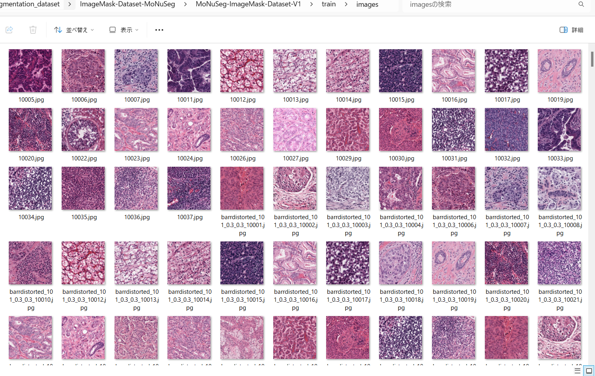

<h2>ImageMask-Dataset-MoNuSeg (2024/06/26)</h2>

This is ImageMask Dataset for MoNuSeg(Multi Ogran Nuclei Segmentation) 2018. 
The dataset used here has been taken from the following web-site 
<b>Challenges/MoNuSeg/Data</b> 
<pre>
https://monuseg.grand-challenge.org/Data/
</pre>
<!--
<b>Training Data</b> 
The dataset (images and annotations) can be downloaded using the following links
<a href="https://drive.google.com/file/d/1ZgqFJomqQGNnsx7w7QBzQQMVA16lbVCA/view?usp=sharing"><b>MoNuSeg 2018 Training data</b></a> 
 
<b>Testing Data</b> 
Test set images with additional 7000 nuclear boundary annotations are available here
<a href="https://drive.google.com/file/d/1NKkSQ5T0ZNQ8aUhh0a8Dt2YKYCQXIViw/view?usp=sharing">
<b>MoNuSeg 2018 Testing</b></a>
-->
 

<b>Download ImageMask-Dataset</b> 
You can download our dataset from the google drive <a href="https://drive.google.com/file/d/1QY6VAFbZSwDmtGVGYYiU9xwWXpQ2yFbn/view?usp=sharing">
MoNuSeg-2018-ImageMask-Dataset-V1.zip</a>
 

<h3>1. Dataset Citation</h3>
Please cite the following papers if you use the training and testing datasets of this challenge: 

N. Kumar et al., "A Multi-organ Nucleus Segmentation Challenge," in IEEE Transactions on  
Medical Imaging (in press) [Supplementary Information] [Code] 
N. Kumar, R. Verma, S. Sharma, S. Bhargava, A. Vahadane and A. Sethi,  
"A Dataset and a Technique for Generalized Nuclear Segmentation for Computational Pathology," 
in IEEE Transactions on Medical Imaging, vol. 36, no. 7, pp. 1550-1560, July 2017 [Code] 
 

<b>License</b>: CC BY-NC-SA 4.0  

<h3>2. ImageMaskDataset Generation</h3>

Please download the master MoNuSeg Training and Testing data from the Google-drive..  
<a href="https://drive.google.com/file/d/1ZgqFJomqQGNnsx7w7QBzQQMVA16lbVCA/view?usp=sharing"><b>MoNuSeg 2018 Training data</b></a> 
<a href="https://drive.google.com/file/d/1NKkSQ5T0ZNQ8aUhh0a8Dt2YKYCQXIViw/view?usp=sharing">
<b>MoNuSeg 2018 Testing</b></a>

 

Please run the following command for Python script <a href="./ImageMaskDatasetGenerator.py">ImageMaskDatasetGenerator.py</a>.
 
<pre>
> python ImageMaskDatasetGenerator.py
</pre>
This will generate two types dataset, <b>MoNuSeg-master and mini_test</b>
 from the master Training and Testing datatset. 
<pre>
./MoNuSeg-master
├─images
└─masks
./mini_test
├─images
└─masks
</pre>
MoNuSeg-master was generated from Training data, and mini_test from Testing data respectively. 
 

<b>Training Data Tissue Images</b> 
 
 
<b>Testinng Data Tissue Images</b> 
 
 

As shown above, the number of the original Tissue-images in Training data is only 37, and too small to use for a training of a segmentation model.
Therefore, in order to increase of the number of the training data, we applied the following data augmentation methods to the orginal Training data. 
<li>hfip</li>
<li>vflip</li>
<li>rotation</li>
<li>shrinking</li>
<li>deformation</li>
<li>distortion</li>
<li>barrel_distortion</li>
<li>pincussion_distortion</li>
 
On detail of these methods, please refer to <a href="./ImageMaskDatasegGenerator.py">ImageMaskDatasegGenerator.py</a>. 
Furthermore, we resized all images and masks in the Training dataset to 512x512 pixels from their original 1000x1000 pixels to create the MoNuSeg-master dataset
to be acceptable as a training dataset for an ordinary UNet Segmentation Model.
 In contrast, we retained all images and masks in the Testing dataset at their original 1000x1000 pixels to create the mini_test dataset. 
 

 
<h3>3. Split master</h3>

Pleser run the following command for Python <a href="./split_master.py">split_master.py</a> 
 
<pre>
>python split_master.py
</pre>
This splits MoNuSeg-master into test, train and valid subdataet. 
<pre>
./MoNuSeg-ImageMask-Dataset-V1
├─test
│  ├─images
│  └─masks
├─train
│  ├─images
│  └─masks
└─valid
    ├─images
    └─masks
</pre>

Train images sample 
  
Train mask sample 
  

Dataset Statictics  
 
